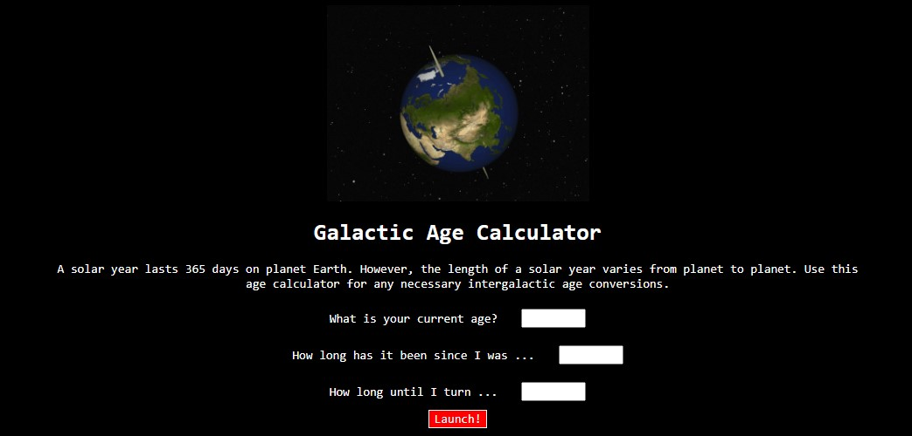

# Galactic Age Calculator

#### By Dani Steely

#### This is a basic program that takes an inputted age, past age, and future age from the user and outputs: the users ages on 5 planets including Earth, the amount of time since the user's inputted past age on 5 planets including Earth, and the amount of time until the user's inputted future age on 5 planets including earth. This project was created to practice using TDD in a development environment built for the project

## Technologies Used

* _TDD_
* _HTML_
* _Javascript_
* _Jest_
* _Babel_
* _ESLint_

## Description

This project was created to practice building a development environment and then to build a program using TDD methodology. The program takes a user's inputted current age, a past age, and a future age. The program uses javascript classes to output: the user's current age on 5 planets (Earth, Mercury, Venus, Mars, and Jupiter), the amount of time since the user's inputted past age on the same five planets, and the amount of time until the user's inputted future age on the same five planets. This project uses Jest and Babel in testing and ESLint for linting. The calculations for this program are very basic math and may not be very exact.

## Setup/Installation Requirements

* _clone project from github_
* _you will need to install all packages using command $ npm install_
* _the packages included are listed in the file named package.json_
* _you will need to build the project using command $ npm run build_
* _project is setup to lint js files using command $npm run lint_
* _project is setup to test js files using command $npm run test_
* _you can see these setup scripts in the package.json file under scripts_

## Known Bugs

* _No known bugs at this time_

## Image Attribution
Please
## License

Permission is hereby granted, free of charge, to any person obtaining a copy of this software and associated documentation files (the "Software"), to deal in the Software without restriction, including without limitation the rights to use, copy, modify, merge, publish, distribute, sublicense, and/or sell copies of the Software, and to permit persons to whom the Software is furnished to do so, subject to the following conditions:

The above copyright notice and this permission notice shall be included in all copies or substantial portions of the Software.

THE SOFTWARE IS PROVIDED "AS IS", WITHOUT WARRANTY OF ANY KIND, EXPRESS OR IMPLIED, INCLUDING BUT NOT LIMITED TO THE WARRANTIES OF MERCHANTABILITY, FITNESS FOR A PARTICULAR PURPOSE AND NONINFRINGEMENT. IN NO EVENT SHALL THE AUTHORS OR COPYRIGHT HOLDERS BE LIABLE FOR ANY CLAIM, DAMAGES OR OTHER LIABILITY, WHETHER IN AN ACTION OF CONTRACT, TORT OR OTHERWISE, ARISING FROM, OUT OF OR IN CONNECTION WITH THE SOFTWARE OR THE USE OR OTHER DEALINGS IN THE SOFTWARE.

Copyright (c) _12/23/2022_ _Dani Steely_

## Image Attribution
Please click images for attribution information

